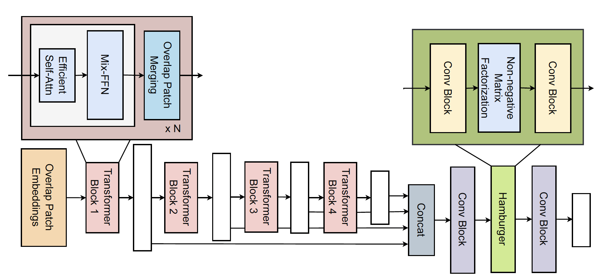

<div align="center">
<h1>Gasformer </h1>
<h3>Gasformer: A Transformer-based Architecture for Segmenting Methane Emissions from Livestock in Optical Gas Imaging</h3>

[Toqi Tahamid Sarker](https://scholar.google.com/citations?hl=en&pli=1&user=i1SmuwYAAAAJ)<sup>1</sup>,[Mohamed G Embaby](https://scholar.google.com/citations?hl=en&user=N4Pc3A0AAAAJ)<sup>2</sup>,[Khaled R Ahmed](https://scholar.google.com/citations?user=FYKqgh4AAAAJ&hl=en)<sup>1</sup>, [Amer AbuGhazaleh](https://scholar.google.com/citations?hl=en&user=FxqWjHsAAAAJ)<sup>2</sup>,

<sup>1</sup> School of Computing, <sup>2</sup>  School of Agricultural Sciences.
Southern Illinois University

Paper: ([arXiv 2404.10841](https://arxiv.org/abs/2404.10841))

</div>


- [Abstract](#abstract)
- [Getting Started](#getting-started)
  - [GasFormer Installation](#gasformer-installation)
- [Star History](#star-history)
- [Citation](#citation)
- [Acknowledgment](#acknowledgment)


## Abstract
Methane emissions from livestock, particularly cattle, significantly contribute to climate change. Effective methane emission mitigation strategies are crucial as the global population and demand for livestock products increase. We introduce Gasformer, a novel semantic segmentation architecture for detecting low-flow rate methane emissions from livestock, and controlled release experiments using optical gas imaging. We present two unique datasets captured with a FLIR GF77 OGI camera. Gasformer leverages a Mix Vision Transformer encoder and a Light-Ham decoder to generate multi-scale features and refine segmentation maps. Gasformer outperforms other state-of-the-art models on both datasets, demonstrating its effectiveness in detecting and segmenting methane plumes in controlled and real-world scenarios. On the livestock dataset, Gasformer achieves mIoU of 88.56%, surpassing other state-of-the-art models.

<p align="center">
  <div style="position: relative; display: inline-block;">
    
    <!--  -->
  </div>
</p>


## Getting Started


### GasFormer Installation

**Step 1: Clone the Gasformer repository:**

To get started, first clone the Gasformer repository and navigate to the project directory:


```bash
git clone https://github.com/toqitahamid/Gasformer.git
cd Gasformer
```


**Step 2: Environment Setup:**

Gasformer recommends setting up a conda environment and installing dependencies via pip or conda. Use the following commands to set up your environment:

***Create and activate a new conda environment***

```bash
conda create -n gasformer python=3.8
conda activate gasformer
```

***Install Dependencies***

***Install PyTorch and CUDA***

```bash
conda install pytorch torchvision torchaudio pytorch-cuda=11.8 -c pytorch -c nvidia
```

***Install MMSegmentation dependencies***

```bash
pip install -U openmim
mim install mmengine
mim install "mmcv>=2.0.0"
```

***Install additional packages***

```bash
conda install conda-forge::ftfy
conda install conda-forge::tensorboard
pip install wandb
conda install anaconda::ipykernel
```

***Verification***

Gasformer is based on MMSegmentation 1.2.1, so we need to check the versions of PyTorch, MMCV and MMSegmentation.

```bash
python -c "import torch, mmcv, mmseg; print(torch.__version__, mmcv.__version__, mmseg.__version__)"
```


## Star History

[](https://star-history.com/#toqitahamid/Gasformer&Date)


## Citation

```
@article{sarker2024gasformer,
      title={Gasformer: A Transformer-based Architecture for Segmenting Methane Emissions from Livestock in Optical Gas Imaging}, 
      author={Toqi Tahamid Sarker and Mohamed G Embaby and Khaled R Ahmed and Amer AbuGhazaleh},
      journal={arXiv preprint arXiv:2404.10841},
      year={2024},
}
```


## Acknowledgment

This project is based on Segformer ([paper](https://arxiv.org/abs/2105.15203), [code](https://github.com/NVlabs/SegFormer/tree/master)), Light-Ham ([paper](https://arxiv.org/abs/2109.04553), [code](https://github.com/Gsunshine/Enjoy-Hamburger/tree/main/seg_light_ham)), and [MMsegmentation](https://github.com/open-mmlab/mmsegmentation). Thanks for their excellent works.
